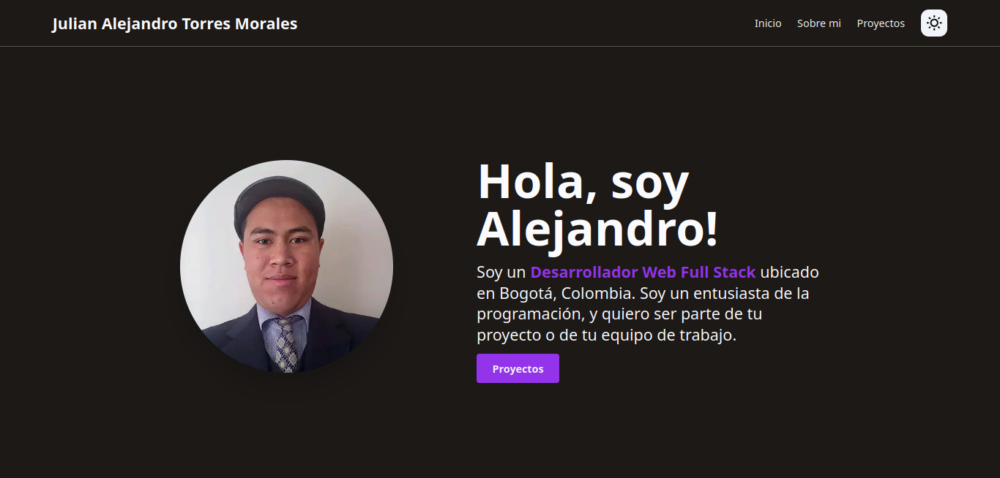

# Portfolio Web

Esta es mi página de portafolio, hecho con Tailwind CSS y Next.js. Créditos a Hosna Qasmei, autora de la plantilla fuente de esta página.
Repositorio fuente: `https://github.com/hqasmei/tailwindcss-and-nextjs-portfolio` - Video tutorial: `https://www.youtube.com/watch?v=7gnVzj_nMJw`



## Ejecutar Localmente

Esta aplicación puede ejecutarse desde un IDE como VS Code, o desde la terminal, y estará disponible desde `http://0.0.0.0:3000` o desde `http://localhost:3000`ejecutando los siguientes comandos:

```bash
npm install
npm run dev
```
